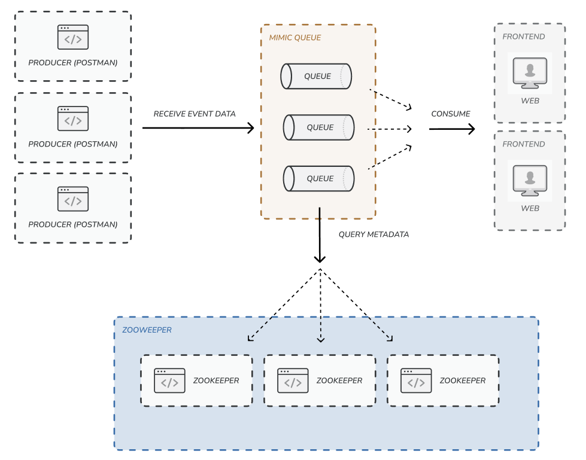
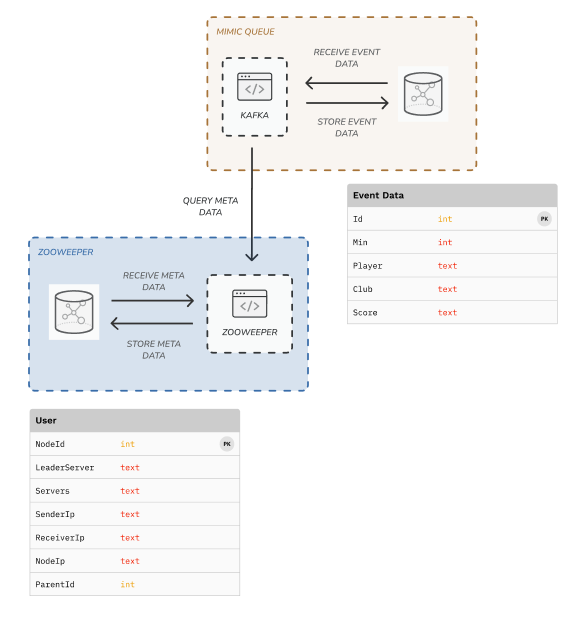

# ZooWeeper: 50.041 Distributed System Project

## Technical Diagrams
### High-Level Architecture
 
### Implementation Focus (Checkpoint 1)


## Local development
### Zookeeper Server
- Create database:
```shell
cd zooweeper/server/database
sqlite3 zooweeper-metadata.db < zooweeper-metadata.sql
```
- Run: 
```shell
cd zooweeper/server
go mod tidy 
go run main.go
```
- Output: `pong` on `localhost:8080`
### Kafka Server (Express)
- Create database:
```shell
cd zooweeper/kafka-server
sqlite3 kafka-events.db < kafka-events.sql
```
- Run:
```shell
cd zooweeper/kafka-server
npm install
npm start
```
- Output: `Events` json on `localhost:9092`
### Kafka Client Application (React)
- Run: 
```shell
cd zooweeper/kafka-react-app
npm install
npm start
```
- Output: formatted `Events` json on `localhost:9092`  (when Kafka Server is running)

### Distributed System Demo
- Overview: The above applications would be dockerized:
  - 3x Zookeeper Server
  - 2x Kafka Server (Express)
  - 1x Kafka Client Application (React)
- Run:
```shell
cd zooweeper
docker-compose up
```

## References:
- [Apache Zookeeper Java implementation](https://github.com/apache/zookeeper)
- [Zookeeper Paper](https://pdos.csail.mit.edu/6.824/papers/zookeeper.pdf)
- [Zab Paper](https://ieeexplore.ieee.org/stamp/stamp.jsp?arnumber=5958223)
- [Native Go Zookeeper Client Library](https://github.com/go-zookeeper/zk)
