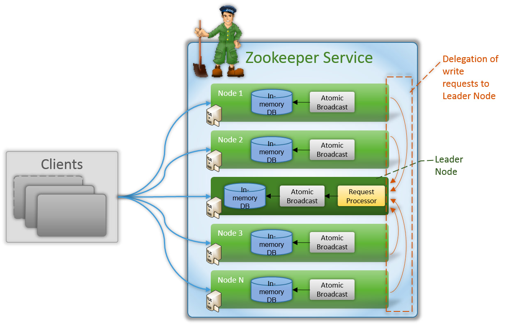
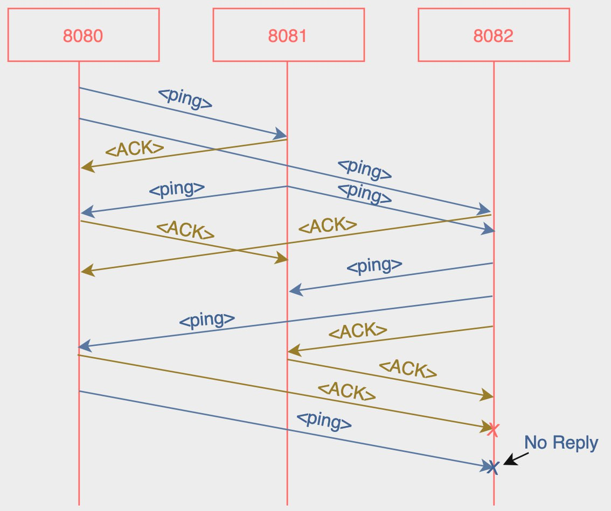
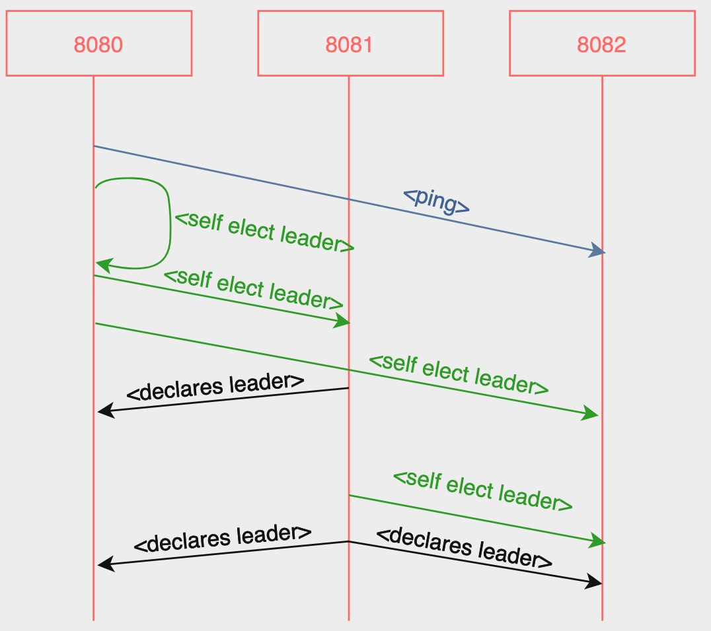
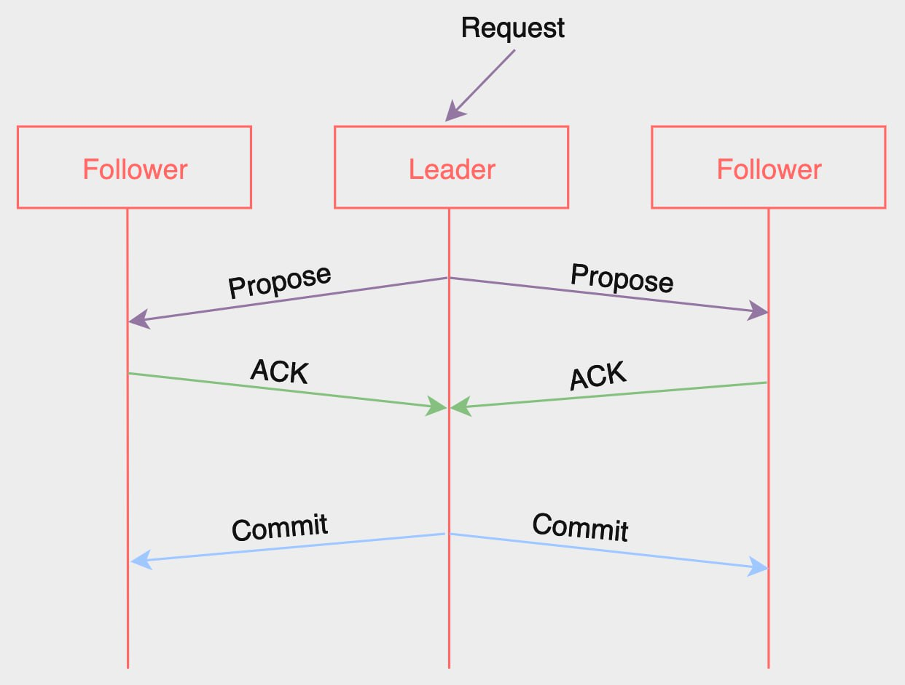

 # ZooWeeper: 50.041 Distributed System Project

## Technical Diagrams
### High-Level Architecture


### ZooKeeper Internal Architecture


### Implementation Focus (Checkpoint 2)


### Forwarding 100 requests to followers and leaders respectively
#### Random

#### 100 Requests to followers

#### 100 Requests to leaders


### Health Check

#### a. Ping Pong

For health check, we use a simple ping pong mechanism. Every second, each node will send a ping to other nodes in the cluster to check if they are alive.
If a node does not receive a pong back from a node.
- a. If the node it does not receive a pong from is a leader, it will start a leader election to elect a new leader.
- b. If the node it does not receive a pong from is a follower, it will remove the follower from its list of followers.


### Leader Election

#### a. Leader Election Single Port

#### b. Leader Election Multiple Ports

#### c. Killing Leader

#### d. Killing Follower


### Write/Read Request


## ZooKeeper Internals
### 1. Data Synchronization: [./server/zab](./server/zab/zab.go)
#### Atomic Broadcast Protocol
- **Reliable delivery**:
  - using `WriteOpsMiddleware` to process all Write request:
    - All Write requests to Follower is forwarded to Leader
    - Leader only commit Write request once all Followers acknowledged
- **Total order**:
  - using state `ProposalState` and mutex `proposalMu`
    - requests are processed according to state changes
- **Causal order**:
  - using a min Priority Queue to order `RequestItem` by timestamp from Client's requests
  - assumption: no clock synchronization issue between Clients
#### Linearization Write and FIFO Client Order
- By ensuring 3 properties above
#### Case 1: Client (Kafka-Server) Request to Leader: Proposal, Ack, Commit

#### Case 2: Client (Kafka-Server) Request to Follower: Forward, Proposal, Ack, Commit

### 2. Distributed Coordination
### 3. Fault Tolerance
#### a. Kill Leader (Permanent Fault)

#### b. Kill Leader and Revive (Intermittent Fault)

#### c. Kill Kafka Server

#### d. Kill React Client


### 4. Scalability
As the number of nodes increases, the corresponding rise in time is not notably significant.

| No. of Nodes | 1 Request | 10 Requests | 100 Requests |
|--------------|-----------|-------------|--------------|
| 3            | 0.261195  | 2.22739     | 21.3898      |
| 5            | 0.326156  | 2.26135     | 22.5576      |
| 7            | 0.337329  | 2.40302     | 23.191       |
| 9            | 0.333107  | 2.48438     | 24.343       |


## Local development
### Postman
- Start a new Postman workspace: https://web.postman.co/workspaces
- Import **Collections** from [./postman](./postman)
- Set **Environments**:
  - `goBaseUrl=8080`
  - `expressBaseUrl=9090`
### Zookeeper Server
- Run: 
```shell
cd zooweeper/server
go mod tidy 
PORT=8080 go run main.go
```
- Output: `pong` on `localhost:8080`
### Kafka Server
- Run:
```shell
cd zooweeper/kafka-server
npm install
PORT=9090 npm start
```
- Output: `Events` json on `localhost:9090`
### Kafka React Application
- Run: 
```shell
cd zooweeper/kafka-react-app
npm install
PORT=3000 npm start
```
- Output: formatted `Events` json on `localhost:3000`  (when Kafka Server is running)

### Distributed System Demo
- You can choose how many of each services to deploy. Example for:
  - 5x ZooWeeper Servers
  - 4x Kafka Servers
  - 3x Kafka React Applications
  ```shell
  cd zooweeper
  ./deployment.sh 5 4 3
  ```
- Test sending of `10` requests from Kafka Server `9090` piggybacking `Clients` metadata `"9090,9091,9092"`
```shell
cd zooweeper
./send_requests.sh 10 9090 "9090,9091,9092"
```


## References:
- [Zookeeper Internals](https://zookeeper.apache.org/doc/r3.9.0/zookeeperInternals.html)
- [Apache Zookeeper Java implementation](https://github.com/apache/zookeeper)
- [Zookeeper Paper](https://pdos.csail.mit.edu/6.824/papers/zookeeper.pdf)
- [Zab Paper](https://ieeexplore.ieee.org/stamp/stamp.jsp?arnumber=5958223)
- [Native Go Zookeeper Client Library](https://github.com/go-zookeeper/zk)
