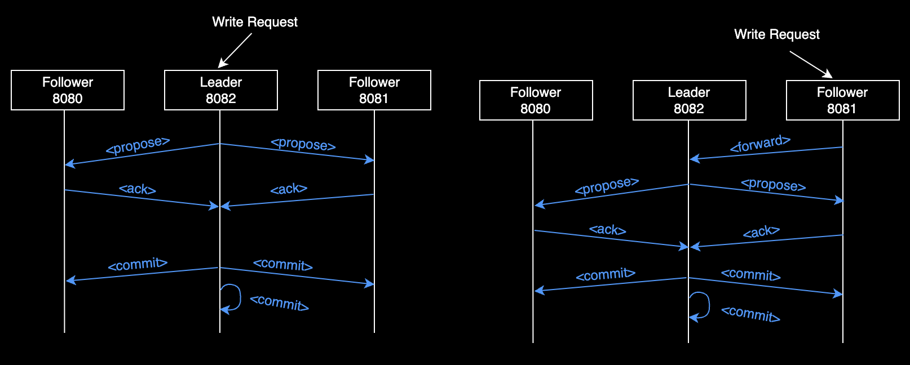
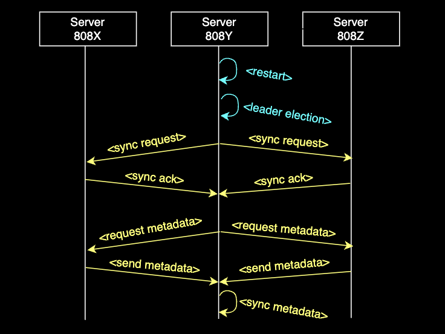

# ZooWeeper: [50.041 Distributed System and Computing](https://istd.sutd.edu.sg/undergraduate/courses/50041-distributed-systems-computing/)

> This README only shows the system architecture, protocol overview and testing scenarios. A more detailed report can be found [here]().
## 0. System Architecture
We designed an end-to-end producer-consumer Kafka use case - **Ordered List of Football Goals Timeline** consisting of 4 main components:
1. **ZooWeeper**:
   - our simplified version of the ZooKeeper server to store metadata for Kafka
   - implemented in Go 
2. **Mimic Queue**:
   - a messaging queue as our simplified version of the Kafka broker to keep track of football goals (Event Data)
   - implemented using Express framework
3. **Producer**:
   - HTTP requests to insert Event Data to our Mimic Queue
   - either through Postman requests OR shell script (“curl” command)
4. **Consumer**:
   - a Frontend application to display the Event Data from our Mimic Queue
   - implemented using React framework


## 1. ZooWeeper Internals
We built a ZooWeeper ensemble, in which each ZooWeeper server consists of 3 main components [(Ref)](https://pdos.csail.mit.edu/6.824/papers/zookeeper.pdf):
1. **Request Processor**: package [request_processor](server/request_processors/routes.go)
2. **Atomic Broadcast**: package [zab](server/zab/zab.go)
3. **Replicated Database**: package [ztree](server/ztree/interface.go)


## 2. Development
### a. Local
#### ZooWeeper server
For a 3-server ensemble from port `8080` to `8082` with the `8082` as Leader
- Run 1st server with:
   ```shell
   cd zooweeper/server
   go mod tidy 
   PORT=8080 START_PORT=8080 END_PORT=8081 go run main.go
   ```
- Run the other 2 servers similarly but with `PORT=8081` and `PORT=8082`
#### Kafka broker
For a 3-server Kafka cluster from port `9090` to `9091`:
- In 3 different terminals run with different ports:
   ```shell
   cd zooweeper/kafka-broker
   npm install
   PORT=909X npm start
   ```
#### Frontend application
For a 2 frontend application from port `3000` to `3001`:
- In 2 different terminals run with different ports:
   ```shell
   cd zooweeper/kafka-react-app
   npm install
   PORT=300Y npm start
   ```
### b. Distributed System Demo

- Deploy a custom number of ZooWeeper servers, example for a 5-server ensemble:
```shell
cd zooweeper
./deployment.sh 5
```
- Send Write Request for Kafka use case, example for 10 requests:
```shell
cd zooweeper
./send_requests.sh 10
```
- Metadata of the Kafka cluster could be modified by piggybacking the cluster information in the Write Request.
  - Example for Kafka broker `9090` to edit the cluster information to only include port `9090` and `9091`:
      ```shell
      cd zooweeper
      ./send_requests.sh 1 9090 "9090,9091"
      ```
  - Expected Output in the ZooWeeper server's ZTree at `localhost:808X/metadata`
    
    - `NodeId=1`: self-identify ZNode for ZooWeeper ensemble information:
      - `NodePort`: port of the current server
      - `Leader`: Leader server (default highest port)
      - `Servers`: ports of all the servers in the ensemble
      - by design all process ZNode will have this node as `ParentId`
    - `NodeId=2`: process ZNode of Kafka broker with port `9091` (field `SenderIp`)
    - `NodeId=3`: process ZNode of Kafka broker with port `9090` (field `SenderIp`)
    - `NodeId=4`: updated metadata `Clients="9090,9091"` with `version=1` for process ZNode of Kafka broker with port `9090` 
    - This means future request from Producer would no longer reach the `9092` Kafka broker as the cluster metadata changes

## 3. Basic Features
### 3.1. Data Synchronization
#### Protocol:
- A classic 2-phase commit for Write Request [(Ref)](https://zookeeper.apache.org/doc/r3.9.0/zookeeperInternals.html#sc_activeMessaging)
- All Writes are forwarded to Leader while Read are done locally

#### Demo:
- Scenario 1: Write Request to Leader: Proposal, Ack, Commit

- Scenario 2: Write Request to Follower: Forward, Proposal, Ack, Commit


### 3.2 Distributed Coordination
#### Protocol:
- Regular Health Check to detect failure
- Leader Election using Bully Algorithm

#### Demo:
- Scenario 1: regular Health Check

- Scenario 2: Leader Election triggered when a single server join

- Scenario 3: Leader Election triggered when multiple servers join

- Scenario 4: Leader Election triggered when Leader server fails

- Scenario 5: no Leader Election triggered when Follower server fails


## 3. Consistency
Our ZooWeeper implementation ensures **Linearization write**, **FIFO client order** and **eventual consistency**.
In our scenarios below, we used [send_requests.sh](./send_requests.sh) to simulate 100 of Write Requests while ensuring the Event Data in the
Frontend application is still in order (by `Minute`):
- Scenario 1: Send 100 requests all to Leader server

- Scenario 2: Send 100 requests all to Follower servers

- Scenario 3: Send 100 requests randomly to the Leader and Followers


## 4. Scalability
We used [deployment.sh](./deployment.sh) to deploy different number of ZooWeeper servers and test its performance with 
increasing number of Write Requests by [send_requests.sh](./send_requests.sh)

| No. of Nodes | Response Time for 1 request (s)  | Response Time for 10 requests (s) | Response Time for 100 requests (s) |
|--------------|----------------------------------|-----------------------------------|------------------------------------|
| 3            | 0.261195                         | 2.22739                           | 21.3898                            |
| 5            | 0.326156                         | 2.26135                           | 22.5576                            |
| 7            | 0.337329                         | 2.40302                           | 23.191                             |
| 9            | 0.333107                         | 2.48438                           | 24.343                             |

## 5. Fault Tolerance
We tested again 2 main type of faults:
1. Permanent Fault: when a server crash
   - make use of Data Synchronization and Distributed Coordination above  
2. Intermittent Fault: when a server crash and revive
   - additional SyncOps using a modified 2PC to synchronize the metadata when restart
    

In the scenarios below, we tried to kill any of the components and ensure our Kafka use case is still functional
- Scenario 1: Permanent Fault - Kill ZooWeeper Leader server

- Scenario 2: Intermittent Fault - Kill ZooWeeper Leader server and Revive

- Scenario 3: Permanent Fault - Kill Kafka broker

- Scenario 4: Permanent Fault - Kill Frontend application


## References
- [Zookeeper Internals](https://zookeeper.apache.org/doc/r3.9.0/zookeeperInternals.html)
- [Apache Zookeeper Java implementation](https://github.com/apache/zookeeper)
- [Zookeeper Paper](https://pdos.csail.mit.edu/6.824/papers/zookeeper.pdf)
- [Zab Paper](https://ieeexplore.ieee.org/stamp/stamp.jsp?arnumber=5958223)
- [Native Go Zookeeper Client Library](https://github.com/go-zookeeper/zk)

## Acknowledgement
- Assistant Professor [Sudipta Chattopadhyay](https://istd.sutd.edu.sg/people/faculty/sudipta-chattopadhyay/)
- Team members:
  - Tran Nguyen Bao Long [@TNBL265](https://github.com/TNBL265) 
  - Joseph Lai Kok Hong [@kwerer](https://github.com/kwerer)
  - Ernest Lim [@Anteloped](https://github.com/Anteloped)
  - Eunice Chua [@aaaaaec](https://github.com/aaaaaec)
  - Lek Jie Wei [@demeritbird](https://github.com/demeritbird)